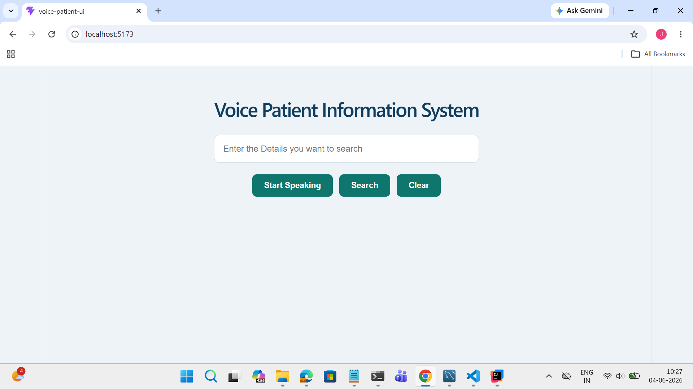
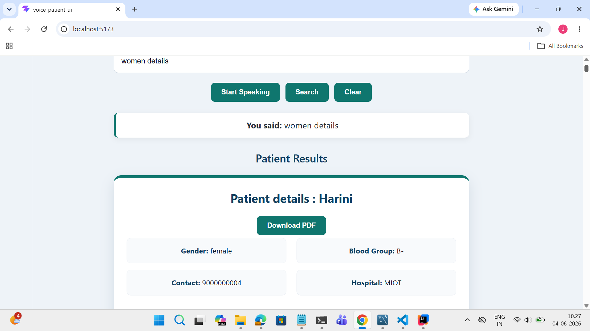
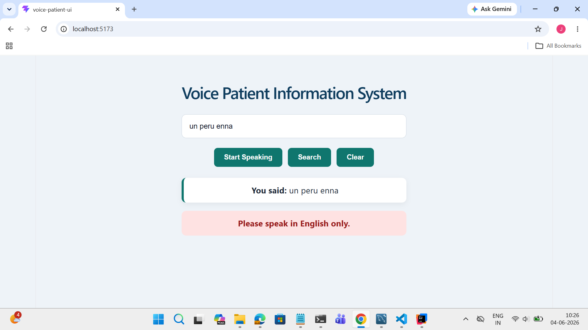
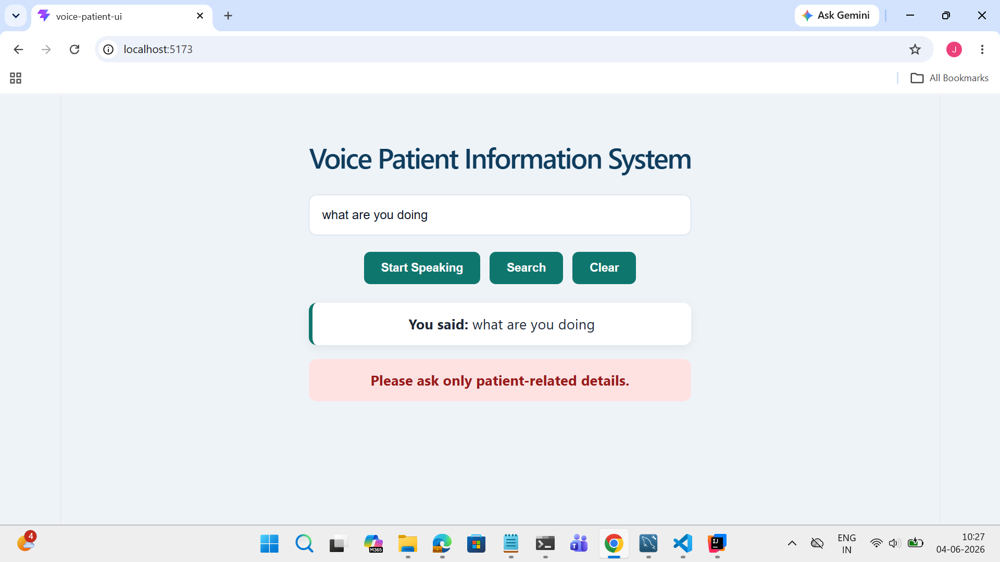
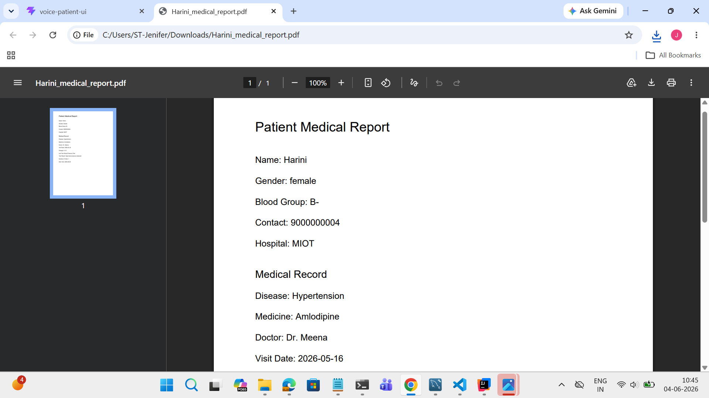

# Voice-Based Patient Information System

## Overview

The Voice-Based Patient Information System is an AI-powered healthcare application that allows users to retrieve patient information using natural language voice queries.

The system combines Speech Recognition, Gemini AI, FastAPI, SQLAlchemy, and MySQL to provide a smart and efficient way of searching patient records.


* Voice-based patient search
* Natural language query processing using Gemini AI
* Semantic search for patient records
* FastAPI REST APIs

* SQLAlchemy ORM integration
* MySQL database support
* PDF report generation
* Patient medical history retriev

* Contact number based search
* Hospital, doctor, disease, medicine, blood group, and gender filtering
* English language validation

## Technology Stack

### Frontend

* React.js
* Vite
* JavaScript
* CSS

### Backend

* FastAPI
* Python
* SQLAlchemy
* Uvicorn

### Database

* MySQL

### AI & Voice

* Google Gemini AI
* Web Speech Recognition API

### PDF Support

* jsPDF
* PyPDF

## System Architecture

Voice Input
→ Speech Recognition
→ React Frontend
→ FastAPI Backend
→ Gemini AI Query Parser
→ SQLAlchemy ORM
→ MySQL Database
→ Patient Records Response

# Project Architecture

```text
+----------------------+
|      User            |
| (Voice / Text Input) |
+----------+-----------+
           |
           v
+----------------------+
| React + Vite Frontend|
|  - SpeechRecognition |
|  - Search UI         |
|  - PDF Download      |
+----------+-----------+
           |
           | HTTP Request (POST)
           v
+----------------------+
| FastAPI Backend      |
|  (Uvicorn Server)    |
+----------+-----------+
           |
           v
+----------------------+
| Gemini AI            |
| Semantic Query Parser|
+----------+-----------+
           |
           | Extract Filters
           v
+----------------------+
| SQLAlchemy ORM       |
+----------+-----------+
           |
           v
+----------------------+
| MySQL Database       |
|                      |
| Patient Table        |
| Medical_Record Table |
| 500,000 Records      |
+----------+-----------+
           |
           v
+----------------------+
| Filtered Patient Data|
+----------+-----------+
           |
           v
+----------------------+
| React Frontend       |
| Display Results      |
| Download PDF Report  |
+----------------------+
```


## Database Design
```text
+------------------+          +----------------------+
|    patient       |          |    medical_record    |
+------------------+          +----------------------+
| patient_id (PK)  |◄─────────| patient_id (FK)      |
| name             |          | record_id (PK)       |
| age              |          | disease              |
| gender           |          | medicine             |
| blood_group      |          | doctor_name          |
| hospital_name    |          | visit_date           |
| contact_number   |          | dosage               |
+------------------+          | lab_tests            |
                              | test_results         |
                              | follow_up_required   |
                              | follow_up_date       |
                              +----------------------+

```

## AI Semantic Search

The system uses Gemini AI to convert natural language queries into structured filters.

Example:

User Query:

Show male patients in Apollo Hospital

AI Output:

{
"gender": "male",
"hospital_name": "apollo"
}

The extracted filters are then applied using SQLAlchemy to retrieve matching records from MySQL.

## Large Dataset Handling

A Python bulk insertion script was used to generate and insert 500,000 patient records into MySQL.

Generated Data:

* Patient names
* Gender
* Blood groups
* Diseases
* Medicines
* Hospital names
* Contact numbers
* Medical records

Batch insertion was used to improve performance and scalability.

## API Endpoints

### Health Check

GET /

### Voice Query Search

POST /voice-query

Request:

{
"text": "male patients in apollo hospital"
}

### Upload PDF Report

POST /upload-report

## Installation

### Backend Setup

Create virtual environment:

python -m venv venv

Activate:

venv\Scripts\activate

Install dependencies:

pip install fastapi
pip install uvicorn
pip install sqlalchemy
pip install pymysql
pip install google-generativeai
pip install python-multipart
pip install pypdf

Run Backend:

uvicorn app.main:app --reload

### Frontend Setup

Install dependencies:

npm install

Run frontend:

npm run dev

## Screenshots

### Home Page 



### Voice search example



### Error Handling (English-only validation)



### Error Handling (Unrelated details)



### PDF Download Output



## Future Enhancements

* Multi-language voice support
* Appointment scheduling
* Role-based authentication
* AI-powered medical recommendations
* Dashboard analytics
* Cloud deployment
* Mobile application support

## Project Outcome

This project demonstrates the integration of Artificial Intelligence, Voice Processing, Full Stack Development, and Database Management to build a scalable healthcare information system capable of handling large datasets and natural language search.

## Author

Jenifer Nivetha
B.Tech Information Technology
